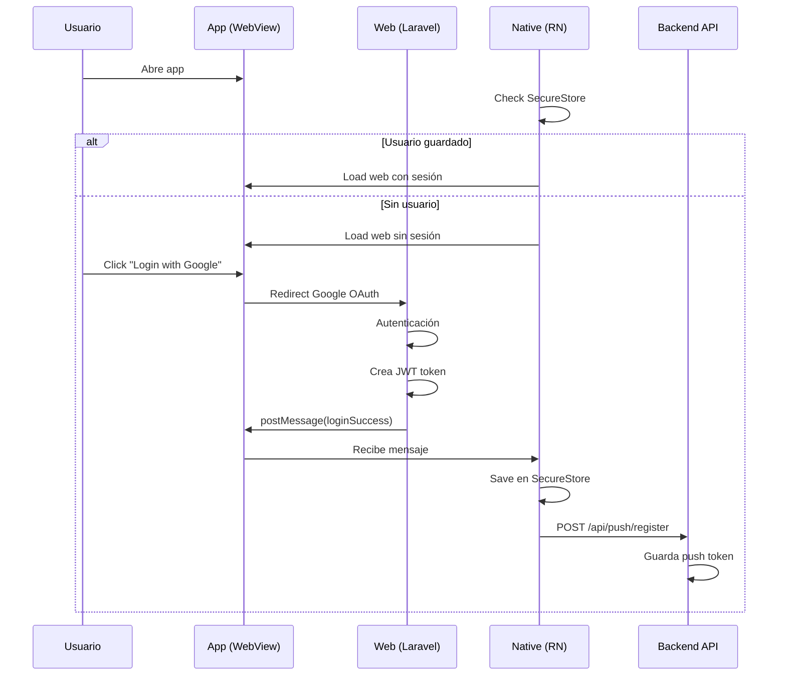
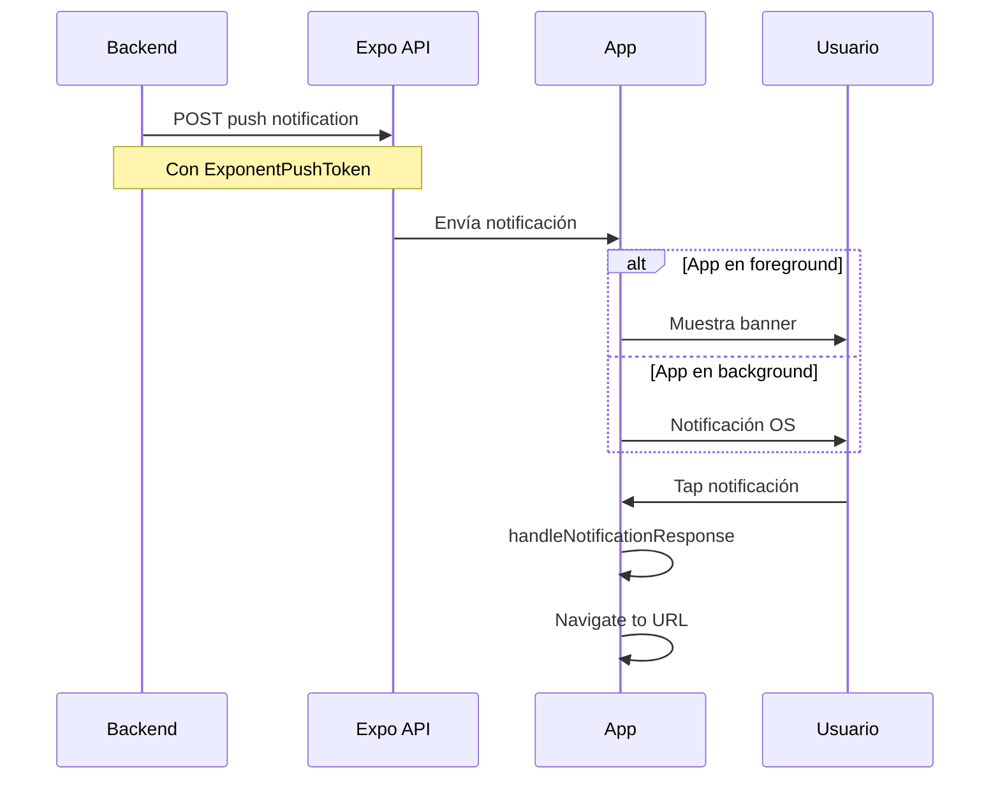
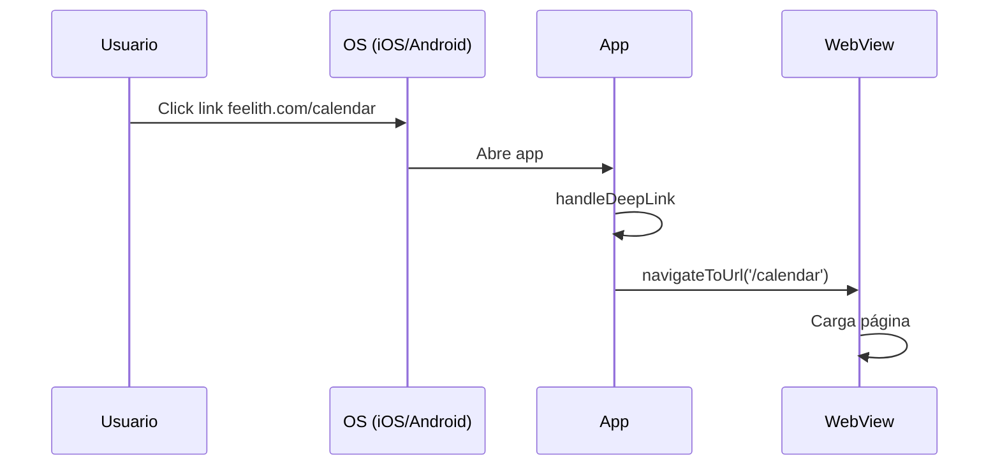

# Feelith/Karma - Project Architecture

> Documentación completa de la arquitectura de los proyectos interconectados Karma (Backend/Web) y Feelith (Mobile App)

**Última actualización**: 2025-10-13
**Versión**: 1.0.0

---

## 📋 Tabla de Contenidos

1. [Visión General](#visión-general)
2. [Estructura de Proyectos](#estructura-de-proyectos)
3. [Karma - Backend Laravel](#karma---backend-laravel)
4. [Feelith - Mobile App React Native](#feelith---mobile-app-react-native)
5. [Interconexión de Proyectos](#interconexión-de-proyectos)
6. [Flujos de Comunicación](#flujos-de-comunicación)
7. [Configuración de Desarrollo](#configuración-de-desarrollo)
8. [Despliegue a Producción](#despliegue-a-producción)

---

## 🎯 Visión General

**Feelith/Karma** es una aplicación de seguimiento emocional (mood tracking) que consta de:

- **Backend Web (Karma)**: Aplicación Laravel con panel web y API
- **Mobile App (Feelith)**: Aplicación React Native que usa WebView para mostrar la web y añade funcionalidades nativas

### Tecnologías Principales

```
Backend:  Laravel 11 + Livewire + MySQL + Filament Admin
Mobile:   React Native + Expo + WebView
Auth:     Google OAuth + Laravel Passport (API)
Hosting:  feelith.com (Laravel Forge)
```

---

## 📁 Estructura de Proyectos

Los proyectos están organizados como carpetas hermanas independientes:

```
/Users/danielperezpinazo/Projects/
├── karma/                    # 🌐 Backend Laravel + Web App
│   ├── app/
│   ├── database/
│   ├── public/
│   ├── routes/
│   └── .git/                # Repositorio independiente
│
└── karma-mobile/            # 📱 Mobile App React Native
    ├── app/
    ├── src/
    ├── assets/
    └── .git/                # Repositorio independiente
```

### ⚠️ Importante

- **Dos repositorios Git separados**: Cada proyecto tiene su propio control de versiones
- **No se deben subir juntos**: El backend se despliega al servidor, la app se publica a las tiendas
- **Desarrollo en paralelo**: Se pueden trabajar ambos proyectos simultáneamente en modo desarrollo

---

## 🌐 Karma - Backend Laravel

### 📍 Ubicación

```bash
/Users/danielperezpinazo/Projects/karma/
```

### 🎯 Propósito

Backend principal que proporciona:
1. **Interfaz web** accesible desde navegador y dentro de la app móvil
2. **API REST** para funcionalidades nativas de la app
3. **Panel administrativo** (Filament) para gestión

### 🗂️ Estructura Clave

```
karma/
├── app/
│   ├── Http/
│   │   └── Controllers/
│   │       ├── Auth/
│   │       │   └── GoogleAuthController.php    # OAuth login
│   │       └── Api/
│   │           ├── AuthController.php          # API auth
│   │           └── PushNotificationController.php
│   ├── Livewire/                               # Componentes web
│   │   ├── Dashboard.php
│   │   ├── MoodPrompts.php
│   │   └── Calendar.php
│   └── Models/
│       ├── User.php
│       ├── MoodEntry.php
│       └── CalendarEvent.php
│
├── database/
│   └── migrations/
│       ├── 2025_10_12_174817_add_push_notification_fields_to_users_table.php
│       └── ...
│
├── public/
│   └── js/app/
│       └── nativeApp.js                        # Bridge WebView ↔ Native
│
├── routes/
│   ├── web.php                                 # Rutas web
│   └── api.php                                 # Rutas API
│
└── resources/views/
    └── layouts/
        └── app.blade.php                       # Layout principal
```

### 🔑 Funcionalidades Principales

#### 1. **Google OAuth Authentication**
```php
// routes/web.php
Route::prefix('auth/google')->group(function () {
    Route::get('redirect', [GoogleAuthController::class, 'redirect']);
    Route::get('callback', [GoogleAuthController::class, 'callback']);
});
```

**Flujo**:
1. Usuario inicia login con Google
2. Se genera token JWT con Laravel Passport
3. Se guarda en sesión para la app móvil
4. Se envía mensaje `loginSuccess` al WebView

#### 2. **Push Notifications API**
```php
// routes/api.php
Route::post('/api/push/register', [PushNotificationController::class, 'register']);
```

**Campos en User**:
```php
'push_token'          // ExponentPushToken[...]
'push_platform'       // 'ios' | 'android'
'push_enabled'        // boolean
'push_registered_at'  // timestamp
```

**Endpoints**:
- `POST /api/push/register` - Registrar token
- `POST /api/push/register` (con `remove: true`) - Des-registrar en logout

#### 3. **Rutas Web Protegidas**
```php
Route::middleware(['auth'])->group(function () {
    Route::get('/dashboard', Dashboard::class);
    Route::get('/calendar', Calendar::class);
    Route::get('/mood-prompts', MoodPrompts::class);
    Route::get('/mood-history', \App\Livewire\MoodHistory::class);
    Route::get('/reports', Reports::class);
    Route::get('/ai-insights', AIInsights::class);
    Route::get('/sharing-settings', SharingSettings::class);
    Route::get('/settings', Settings::class);
});
```

### 🔗 URLs del Backend

```
Desarrollo: http://127.0.0.1:8000
Producción: https://feelith.com
```

### 🗄️ Base de Datos

**Motor**: MySQL (Producción) / SQLite (Desarrollo)

**Tablas Principales**:
- `users` - Usuarios y datos de autenticación
- `mood_entries` - Registros de estado de ánimo
- `calendar_events` - Eventos del calendario sincronizados
- `emotional_selfies` - Selfies emocionales
- `mood_prompts` - Recordatorios de mood check-in
- `shared_access` - Permisos de compartir entre usuarios

---

## 📱 Feelith - Mobile App React Native

### 📍 Ubicación

```bash
/Users/danielperezpinazo/Projects/karma-mobile/
```

### 🎯 Propósito

Aplicación móvil nativa que:
1. **Encapsula la web** dentro de un WebView
2. **Añade funcionalidades nativas**: Push notifications, deep linking, sharing
3. **Gestiona autenticación** de forma persistente con SecureStore

### 🗂️ Estructura Clave

```
karma-mobile/
├── app/
│   └── (tabs)/
│       └── index.js                            # HomeScreen principal
│
├── src/
│   ├── components/
│   │   ├── WebViewScreen.js                    # WebView component
│   │   └── FloatingActionButton.js             # FAB con menú
│   │
│   ├── config/
│   │   └── config.js                           # ⚙️ CONFIGURACIÓN CENTRAL
│   │
│   ├── contexts/
│   │   └── AuthContext.js                      # Estado de autenticación
│   │
│   ├── hooks/
│   │   └── useAuth.js                          # Hook de autenticación
│   │
│   ├── screens/
│   │   └── WebViewScreen.js                    # Pantalla WebView
│   │
│   ├── services/
│   │   ├── authService.js                      # SecureStore auth
│   │   ├── pushService.js                      # Expo notifications
│   │   ├── pushTokenService.js                 # Registro de tokens
│   │   ├── deepLinkService.js                  # Deep linking
│   │   └── sharingService.js                   # Native sharing
│   │
│   └── features/
│       └── pushHandler.js                      # Manejo de notificaciones
│
├── assets/
│   └── images/                                 # Íconos y splash screens
│
├── app.config.js                               # Config dinámica de Expo
├── package.json                                # Dependencias
└── README.md
```

### ⚙️ Configuración Central

**Archivo**: `src/config/config.js`

```javascript
const config = {
  // URLs
  WEB_URL: __DEV__ ? 'http://127.0.0.1:8000' : 'https://feelith.com',

  // App Info
  APP_TITLE: 'Feelith',
  APP_SLUG: 'feelith',
  IOS_BUNDLE_ID: 'com.feelith.karma',
  ANDROID_PACKAGE: 'com.feelith.karma',

  // Features
  FEATURES: {
    PUSH_NOTIFICATIONS: true,
    SHARING: true,
    DEEP_LINKING: true,
  },

  // Deep Linking
  DEEP_LINK_SCHEME: 'feelith',
  ASSOCIATED_DOMAINS: ['feelith.com', 'www.feelith.com'],

  // Push Notifications
  EXPO_PROJECT_ID: '19f6a466-105c-4e0a-b68b-ab137a815607',

  // UI
  COLORS: {
    PRIMARY: '#9333EA',    // Purple-600
    SECONDARY: '#7C3AED',  // Purple-700
    // ...
  },
};
```

### 🔑 Funcionalidades Principales

#### 1. **WebView Integration**
```jsx
<WebViewScreen
  ref={webViewRef}
  onMessage={handleWebMessage}
  onNavigate={handleWebViewNavigate}
/>
```

**Características**:
- Carga la web de Karma dentro de la app
- Gestiona cookies y sesión
- Intercepta mensajes desde la web
- Permite navegación programática

#### 2. **Authentication Flow**

```javascript
// authService.js
saveAuthData(userId, userToken, pushTokenEndpoint)
getAuthData()
clearAuthData()
```

**Storage**: Expo SecureStore (iOS Keychain / Android Keystore)

**Persistencia**:
- Al abrir la app, se recuperan credenciales
- Si existen, el usuario permanece logueado
- WebView carga con sesión activa

#### 3. **Push Notifications**

```javascript
// pushTokenService.js
registerPushToken(userId, userToken, pushTokenEndpoint)
unregisterPushToken(userId, userToken, pushTokenEndpoint)
```

**Flujo**:
1. App solicita permisos al usuario
2. Obtiene token de Expo
3. Envía token al backend Laravel
4. Backend guarda token en BD
5. Backend puede enviar notificaciones vía Expo API

#### 4. **Deep Linking**

```javascript
// Esquemas soportados
feelith://dashboard
https://feelith.com/dashboard
```

**Características**:
- URL schemes personalizados (`feelith://`)
- Universal Links iOS
- App Links Android

#### 5. **Floating Action Button (FAB)**

```jsx
<FloatingActionButton
  isLoggedIn={isLoggedIn}
  onNavigate={webViewNavigate}
/>
```

**Acciones**:
- "New Mood" → Navega a `/dashboard`
- (Extensible para más acciones)

---

## 🔄 Interconexión de Proyectos

### Comunicación WebView ↔ Native

#### 1. **Web → Native (postMessage)**

```javascript
// En Karma (Laravel Blade)
window.ReactNativeWebView.postMessage(JSON.stringify({
  action: 'loginSuccess',
  userId: '{{ auth()->id() }}',
  userToken: '{{ session('native_app_token') }}',
  pushTokenEndpoint: '{{ config('app.url') }}/api/push/register'
}));
```

**Mensajes soportados**:
- `loginSuccess` - Usuario se autentica
- `logout` - Usuario cierra sesión
- `share` - Compartir contenido

#### 2. **Native → Web (Navegación)**

```javascript
// En Feelith (React Native)
webViewRef.current.navigateToUrl('/dashboard');
```

**Métodos disponibles**:
- `navigateToUrl(path)` - Navegar a una ruta
- `reload()` - Recargar la página

### API REST Backend ↔ Mobile

```
Native App → API Laravel
```

**Endpoints usados por la app**:

```bash
POST /api/auth/login
  Body: { email, password }
  Response: { token, user }

POST /api/push/register
  Headers: Authorization: Bearer {token}
  Body: { userId, pushToken, platform }
  Response: { success, data }

POST /api/push/register
  Headers: Authorization: Bearer {token}
  Body: { userId, platform, remove: true }
  Response: { success, message }
```

---

## 🔀 Flujos de Comunicación

### Flujo de Login



### Flujo de Push Notification



### Flujo de Deep Link



---

## 💻 Configuración de Desarrollo

### Backend (Karma)

```bash
# Ubicación
cd /Users/danielperezpinazo/Projects/karma

# Instalar dependencias
composer install
npm install

# Configurar entorno
cp .env.example .env
php artisan key:generate

# Configurar base de datos
# Editar .env con credenciales MySQL/SQLite

# Ejecutar migraciones
php artisan migrate

# Instalar Passport
php artisan passport:install

# Iniciar servidor
php artisan serve --host=127.0.0.1 --port=8000

# En otra terminal, si usas assets compilados
npm run dev
```

**URLs de desarrollo**:
- Web: http://127.0.0.1:8000
- Admin: http://127.0.0.1:8000/admin

### Mobile (Feelith)

```bash
# Ubicación
cd /Users/danielperezpinazo/Projects/karma-mobile

# Instalar dependencias
npm install

# Iniciar Expo
npm start

# Opciones:
# - Escanear QR con Expo Go (iOS/Android)
# - Presionar 'i' para iOS Simulator
# - Presionar 'a' para Android Emulator
```

**Configuración**:
- El archivo `src/config/config.js` ya está configurado
- En modo dev: apunta a `http://127.0.0.1:8000`
- En producción: apunta a `https://feelith.com`

### Variables de Entorno

#### Backend (.env)

```env
APP_NAME=Karma
APP_URL=http://127.0.0.1:8000  # o https://feelith.com

DB_CONNECTION=mysql
DB_HOST=127.0.0.1
DB_DATABASE=karma
DB_USERNAME=root
DB_PASSWORD=

GOOGLE_CLIENT_ID=xxx
GOOGLE_CLIENT_SECRET=xxx
GOOGLE_REDIRECT_URI=https://feelith.com/auth/google/callback
```

#### Mobile (config.js)

```javascript
// Ya está configurado en src/config/config.js
// No necesita archivo .env
```

---

## 🚀 Despliegue a Producción

### Backend Laravel

**Hosting**: Laravel Forge en feelith.com

```bash
# En local
git add .
git commit -m "Mensaje"
git push origin main

# Forge detecta push y despliega automáticamente
```

**Comandos post-deploy** (configurados en Forge):
```bash
php artisan migrate --force
php artisan config:cache
php artisan route:cache
php artisan view:cache
php artisan queue:restart
```

### Mobile App

**Build para producción**:

```bash
cd /Users/danielperezpinazo/Projects/karma-mobile

# iOS
eas build --platform ios

# Android
eas build --platform android

# Submit a tiendas
eas submit --platform ios
eas submit --platform android
```

**Pre-requisitos**:
1. Cuenta Expo configurada
2. Certificados iOS (Apple Developer)
3. Keystore Android
4. App Store Connect / Google Play Console configurados

---

## 🔐 Seguridad

### Backend

- ✅ HTTPS obligatorio en producción
- ✅ CSRF protection en forms
- ✅ API protegida con Bearer tokens (Passport)
- ✅ Validación de userId en endpoints
- ✅ Rate limiting en API routes

### Mobile

- ✅ Tokens guardados en SecureStore (encrypted)
- ✅ Comunicación solo por HTTPS
- ✅ Validación de dominios en Universal Links
- ✅ No se exponen secrets en el código

---

## 📊 Monitoreo y Logs

### Backend

```bash
# Logs en tiempo real
tail -f storage/logs/laravel.log

# Filtrar por tipo
tail -f storage/logs/laravel.log | grep "ERROR"
tail -f storage/logs/laravel.log | grep "Push token"
```

### Mobile

```bash
# Durante desarrollo con Expo
npm start

# Los logs aparecen en la terminal y en Metro Bundler
```

**Logs importantes**:
- `[HomeScreen]` - Mensajes principales
- `[PushTokenService]` - Registro de tokens
- `[AuthService]` - Autenticación
- `[WebViewScreen]` - Navegación

---

## 🐛 Debugging

### Problemas Comunes

#### 1. "Usuario no se mantiene logueado"

**Síntoma**: Al reabrir app, pide login de nuevo

**Solución**:
```bash
# Verificar que se guarda en SecureStore
# En código React Native:
console.log('[AuthService] Auth data saved:', await getAuthData());
```

#### 2. "Push notifications no llegan"

**Checklist**:
- ✅ Usuario dio permisos
- ✅ Token se registró en backend (verificar BD)
- ✅ EXPO_PROJECT_ID correcto en config
- ✅ Notificación enviada a API de Expo

#### 3. "WebView no carga"

**Verificar**:
```bash
# Backend corriendo
curl http://127.0.0.1:8000

# Config correcta
cat src/config/config.js | grep WEB_URL
```

#### 4. "Deep links no abren la app"

**iOS**: Verificar archivo `.well-known/apple-app-site-association`
**Android**: Verificar archivo `.well-known/assetlinks.json`

---

## 📚 Documentación Adicional

### En el proyecto Karma (Backend)

- `README.md` - Setup del proyecto
- `routes/api.php` - Documentación inline de endpoints
- `database/migrations/` - Esquema de BD

### En el proyecto Feelith (Mobile)

- `README.md` - Setup del proyecto
- `AUTHENTICATION_PROTOCOL.md` - Protocolo de autenticación
- `PUSH_TOKEN_PROTOCOL.md` - Protocolo de push notifications
- `DEEP_LINKING.md` - Configuración de deep linking
- `SHARING.md` - Funcionalidad de compartir

---

## 👥 Contacto y Soporte

**Desarrollador**: Daniel Pérez Pinazo
**Proyecto**: Feelith/Karma
**Versión**: 1.0.0
**Fecha**: Octubre 2025

---

## 📝 Notas Finales

### Para futuras sesiones de Claude Code

**Comandos útiles**:

```bash
# Backend
cd /Users/danielperezpinazo/Projects/karma
php artisan serve

# Mobile
cd /Users/danielperezpinazo/Projects/karma-mobile
npm start

# Ambos proyectos tienen working directories configurados
# Claude Code puede acceder a ambos simultáneamente
```

**Archivos clave para leer primero**:
- `karma/routes/api.php` - Endpoints disponibles
- `karma-mobile/src/config/config.js` - Configuración completa
- `karma-mobile/app/(tabs)/index.js` - Pantalla principal

**Principios de diseño**:
1. **Backend**: Proporciona web y API, no conoce detalles de la app móvil
2. **Mobile**: Consume web via WebView, añade funcionalidades nativas
3. **Comunicación**: Unidireccional via postMessage, bidireccional via API
4. **Seguridad**: Tokens JWT, SecureStore, HTTPS obligatorio

---

**Fin del documento** 🎉
